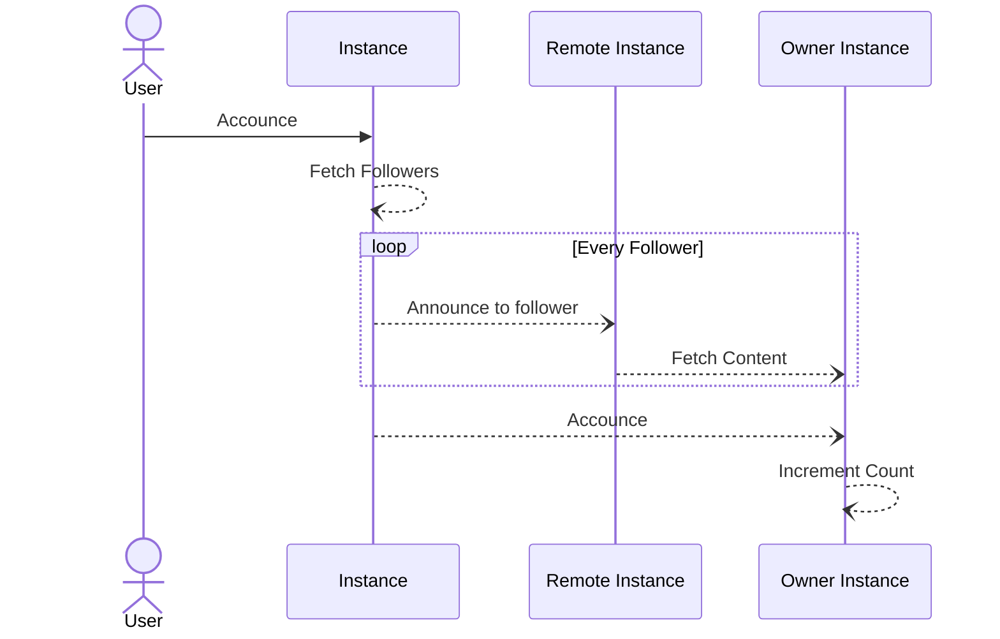

# Announce -> Post

What follows is how a boost/announce/retweet works in Mastodon and any other system that implements against ActivityPub.

When a user clicks on bonk/boost/retweet the following sequence happens.

The users intent is converted to an announce. This announce is sent to every follower they have as well as the owner
of the post that the user is boosting.

In the case of follower instances, they receive the announce, then fetch the content of the announce using the `object` field.

In the case of the owner, they take the announce and increment their boost count.





An example announce appears like the below. Actor is whoever did the boost, cc is the user who's post is being boosted and object contains a link to the post itself. The below assumes the instance honk.boyter.org was boosting a post from another instance named some.instance in this case.

```json
{
  "@context": "https://www.w3.org/ns/activitystreams",
  "actor": "https://honk.boyter.org/u/boyter",
  "cc": [
    "https://some.instance/users/someonemadup"
  ],
  "context": "tag:mastodon.social,2023-01-17:objectId=380216002:objectType=Conversation",
  "id": "https://honk.boyter.org/u/boyter/bonk/234wetsdfw35345",
  "object": "https://some.instance/users/someonemadup/statuses/1231235634623412",
  "published": "2023-01-19T22:41:49Z",
  "to": "https://www.w3.org/ns/activitystreams#Public",
  "type": "Announce"
}
```

When fetching content for the above every remote instance needs to call back to the owner instance in order to fetch the content for display. Instances can require a signed request for this to ensure only followers can see the post, and return 404 generally 

The fetch is done using the object value, with the appropriate header sent.

```bash
curl --location --request GET 'https://some.instance/users/someuser/statuses/123413513412312' --header 'Accept: application/json' 
```

Note that the header should be set to `application/activity+json` or `application/ld+json; profile="https://www.w3.org/ns/activitystreams` to be even more precise, but that some instance 
implementations such as honk will ignore `application/json` for this and not return JSON. This seems to vary by instant type.

 - Mastodon - works with both `application/activity+json` and `application/json` and `application/ld+json; profile="https://www.w3.org/ns/activitystreams`
 - Takahe - works with both `application/activity+json` and `application/json`
 - Honk - withs with `application/activity+json` and `application/ld+json; profile="https://www.w3.org/ns/activitystreams`

It is vital that the owner instance caches the result for these GET requests as popular content could be queried 
many times before a copy being made on all the remote instances.
