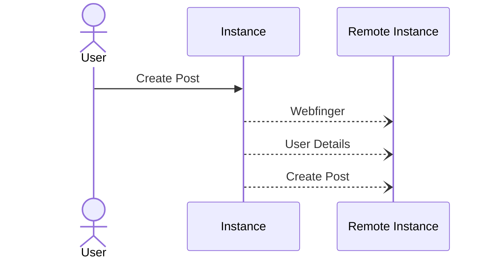

# Create -> Post

Posts tend to be created with a few possible states before being distributed, in Mastodon and other systems.

 - Public. This will appear on the local timeline, and go to all followers of the user, and any @ mentions. Anyone can access this post via API.
 - Mentioned. This will only go to a direct @ mentions in the message itself, and not followers. Such posts should only be accessable to signed requests for the person @ via API.
 - Followers. This will only go to followers, and not appear on the local timeline. Such posts should only be accessable to signed requests by followers via API.
 - Unlisted this goes into everything, but should not allow boosts or other such actions.

takahe also has the following

 - Local Only. This will appear on the local timeline, and go to any local followers.

Rules tend to roll up, so an @ will work in any public, any mentioned or followers for example.

When a post is created by a user the instance performs the following actions.

 - Webfinger any remote instance to get the users address
 - Get the users details in order to know the inbox
 - Message the inbox

For local instances the decision is up to the instance.



Generally the results from webfinger and the user probes are cached to avoid hitting the remote instance again. This information should be possible to cache forever.

Webfinger can be done with a simple get request

`https://some.instance/.well-known/webfinger?resource=acct:someone@some.instance`

User can be fetched by finding the `rel` identified as `self` inside the `links` array. This can then be fetched using the usual headers, `application/activity+json` or `application/ld+json; profile="https://www.w3.org/ns/activitystreams"`. However note that some instance types will work with `application/json` although this is not strictly correct.

```
curl --location --request GET 'https://some.instance/users/someone' \
--header 'Accept: application/ld+json; profile="https://www.w3.org/ns/activitystreams"'
```

The return from the above will contain a field inbox, which in the case of a mastodon system looks like the following `"inbox": "https://some.instance/users/someone/inbox"`. It is this URL that the create must be sent to as a POST.

While technically not a requirement most instances require that any incoming message is signed using the users private key to ensure the message was not forged. This signature is either set via the field `signature` in the json document sent or via the `Signature` HTTP header. Most fediverse platforms create HTTP signatures according to [draft-cavage-http-signatures-12](https://datatracker.ietf.org/doc/html/draft-cavage-http-signatures) specification, which differs significantly from the latest version of the standard.

## Bare Minimum

The bare minimum you need to send a message is the following for any instance that verifies the signature.

 - Public domain accessable by the internet at large, or the private key for a public domain account.
 - Webfinger implementation 
 - User endpoint implementation

With the above in place you should be able to create a message, sign it, send it and have the message verified by the remote instance.

With no verification in place it should be as simple as crafting the appropiate JSON object and then POST at the correct URL.

The below will send a message to the inbox of https://mastinator.com/u/testinbox which you can visit.

Note that the `ShouldBeUniqueDuplicatesIgnoredTillDeleted` must be unique per message, otherwise it will be ignored. The content of the below message will be `Hello!`.

```bash
curl --location --request POST 'https://mastinator.com/u/testinbox/inbox' \
     --header 'Content-Type: application/json' \
     --data-raw '{
      "@context": "https://www.w3.org/ns/activitystreams",
      "actor": "https://mastinator.com/",
      "id": "ShouldBeUniqueDuplicatesIgnoredTillDeleted",
      "object": {
        "content": "Hello!",
        "conversation": "empty",
        "id": "ShouldBeUniqueDuplicatesIgnoredTillDeleted",
        "published": "2022-12-20T06:03:41Z",
        "summary": "",
        "to": "https://www.w3.org/ns/activitystreams#Public",
        "type": "Note",
        "url": "https://mastinator.com/"
      },
      "published": "2022-12-20T06:03:41Z",
      "to": "https://www.w3.org/ns/activitystreams#Public",
      "type": "Create"
     }'
```
