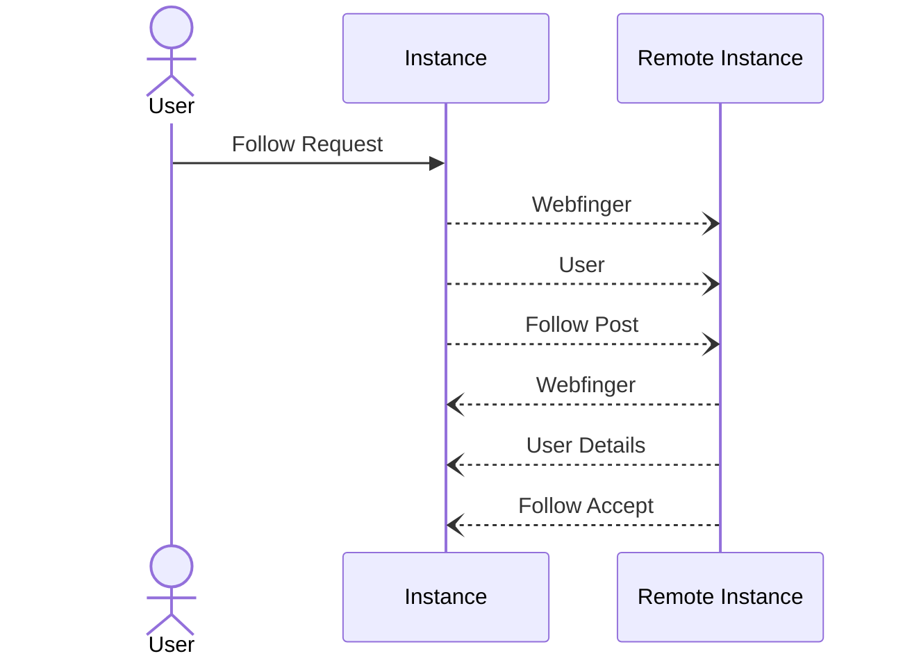

# Follow -> Post


Published time should be in [RFC3339](https://www.rfc-editor.org/rfc/rfc3339) and look like the following `2006-01-02T15:04:05Z07:00`.

The follow accept is not actually required for a follow to work, but is usually done in order to confirm that the follow request has been accepted. In the case where a instance user has set to manually approve follow requests this process can take an indefinate amount of time.



Example follow request to be POST'ed to a user we want to follow.


```json
{
   "@context": "https://www.w3.org/ns/activitystreams",
   "actor": "https://some.instance/u/followinguser",
   "id": "https://some.instance/u/followinguser/sub/someuniqueid",
   "object": "https://another.instance/u/userwewanttofollow",
   "published": "2006-01-02T15:04:05Z07:00",
   "to": "https://some.instance/u/%s/inbox",
   "type": "Follow"
}
```


TODO - Example of follow accept here


Technically there is no need to keep track of who an instance follows, as this information is retained by the remote instance. It is probably useful to retain for displaying to the user however.