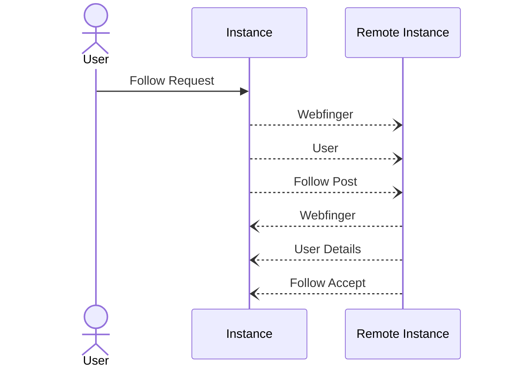

# Follow -> Post


Published time should be in [RFC3339](https://www.rfc-editor.org/rfc/rfc3339) and look like the following `2006-01-02T15:04:05Z07:00`



Example follow request to be POST'ed to a user we want to follow. Note that the actor doing this post


```json
{
   "@context": "https://www.w3.org/ns/activitystreams",
   "actor": "https://some.instance/u/followinguser",
   "id": "https://some.instance/u/followinguser/sub/someuniqueid",
   "object": "https://another.instance/u/userwewanttofollow",
   "published": "2006-01-02T15:04:05Z07:00",
   "to": "https://some.instance/u/%s/inbox",
   "type": "Follow"
}
```

