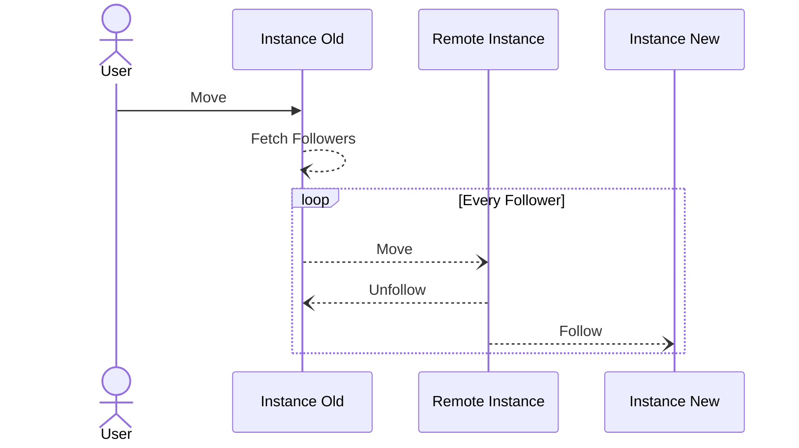

# Move -> Post

Specific to Mastodon https://docs.joinmastodon.org/spec/activitypub/#supported-activities-for-profiles as it is not included in the main w3 spec https://www.w3.org/TR/activitypub/ 

Migrate followers from one account to another. When an account has this set they send the move request to all of their followers indicating that they should unfollow the old account and follow the new one. Previously created posts, and the public/private key that mastodon uses are not migrated.

An example announce appears like the below. The user at old.instance wants to indicate that they have moved their account to new.instance.

```json
{
    "@context": "https://www.w3.org/ns/activitystreams",
    "id": "https://old.instance/users/someusername#moves/1",
    "type": "Move",
    "target": "https://new.instance/users/someothername",
    "actor": "https://old.instance/users/someusername",
    "object": "https://old.instance/users/someusername"
}
```

Note that the move must be signed using the private key of the user before being sent to the followers allowing verification that the request was sent by that account. This must be enfoced to avoid abuse.

```
┌────────────┐ ┌────────────┐ ┌───────────────┐
│    User    │ │  Instance  │ │Remote Instance│
└────────────┘ └────────────┘ └───────────────┘
      │              │               │
      │              │               │
      │              │               │
      │─────Move────▶│               │
      │              │               │
      │              │───────┐       │
      │              │       │       │
      │              │Fetch Followers│
      │              │       │       │
      │              │◀──────┘       │
      │              │               │
      │              │   Move to     │
      │              │──Follower(s)─▶│
      │              │               │
```




